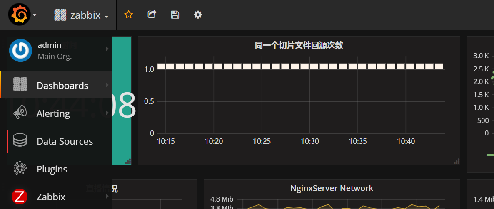
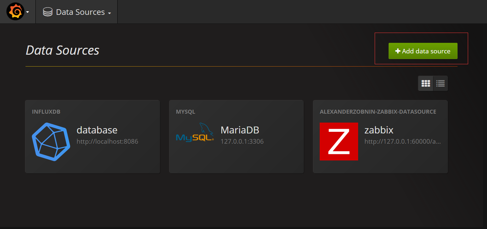
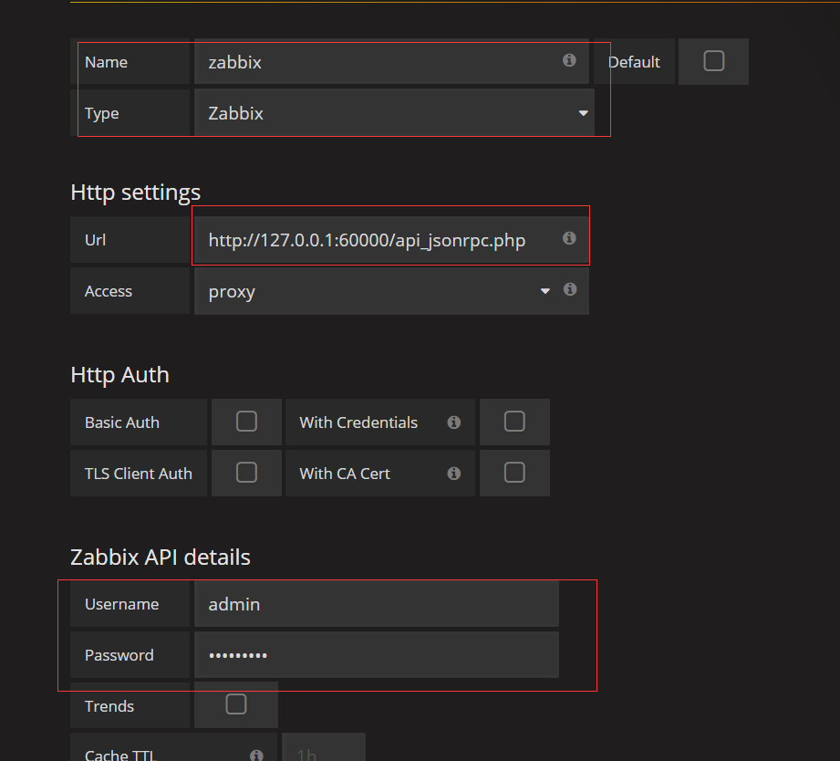
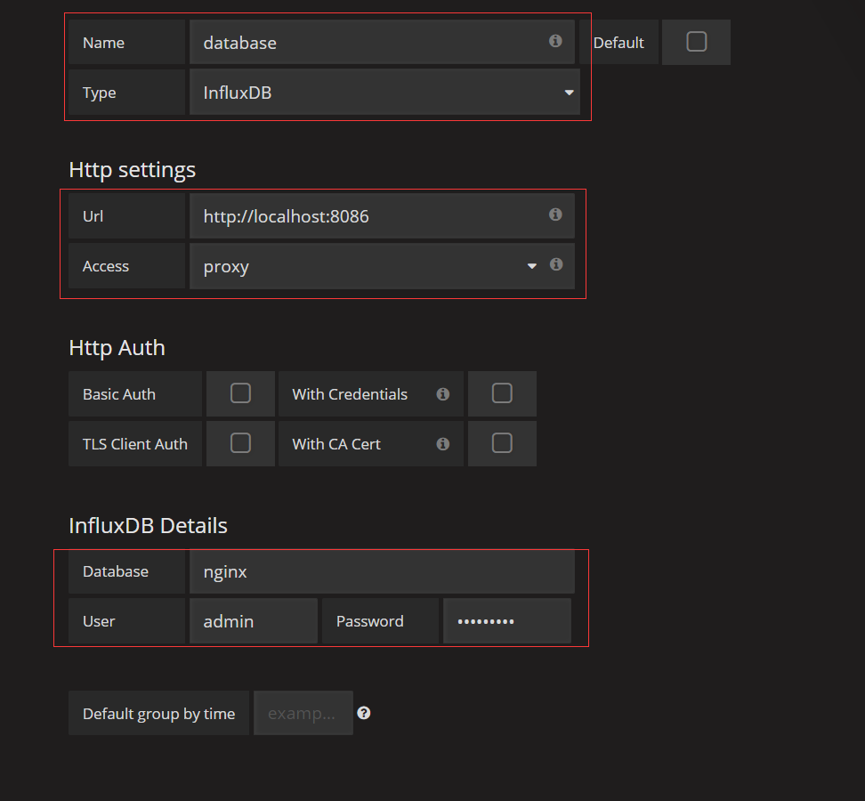
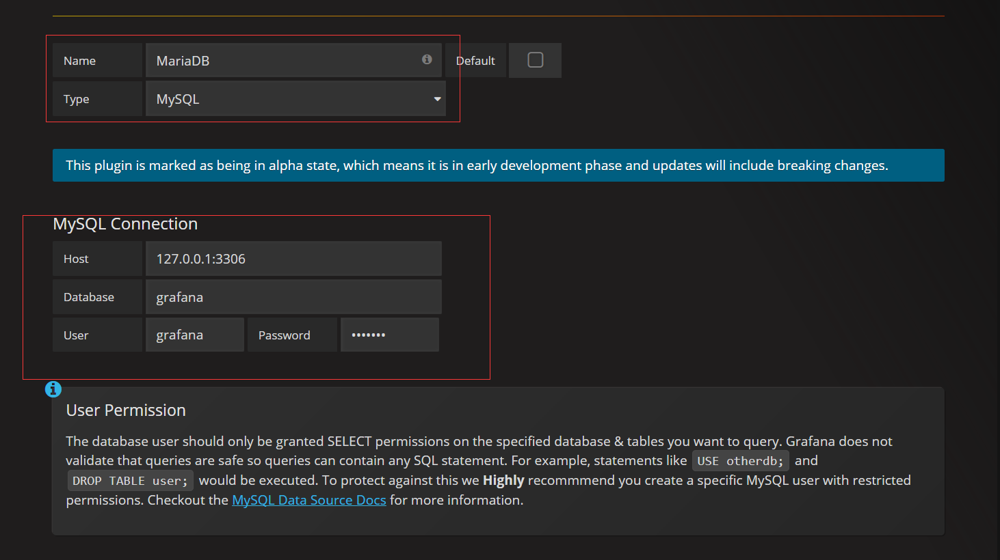
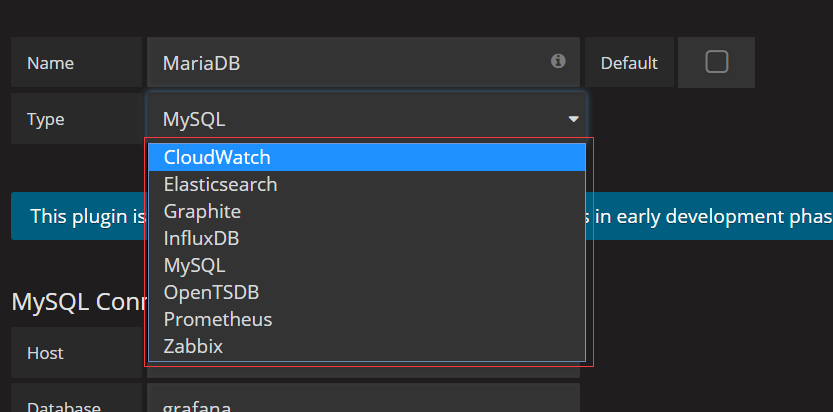

# 自定义监控套件

## influxdb

主要用于存储数据

安装包下载页面https://portal.influxdata.com/downloads

```bash
wget https://dl.influxdata.com/influxdb/releases/influxdb-1.3.5.x86_64.rpm
yum -y install ./influxdb-1.3.5.x86_64.rpm
systemctl start influxdb.service
```

influxdb默认8086端口接受数据库命令`curl -POST http://localhost:8086/query --data-urlencode "q=CREATE DATABASE mydb"`

### 开启认证

编辑/etc/influxdb/influxdb.conf

```bash
[http]
  # 在http配置段中，如下一行后添加配置
  # auth-enabled = false
  auth-enabled = true
```

输入`influx`进入数据库命令模式，输入如下命令，添加一个用户

```mysql
CREATE USER admin with PASSWORD 'password' WITH ALL PRIVILEGES
```

创建了用户之后验证

```bash
curl -G http://localhost:8086/query -u admin:password  --data-urlencode "q=SHOW DATABASES"
```

## grafana

主要用于展示数据

下载页面`https://packagecloud.io/grafana/stable`

```bash
wget https://packagecloud-prod.global.ssl.fastly.net/888/1112/el/7/package_files/229023.rpm?t=1504077159_328f7590eafe5aa0f59759ba4f3f0a6ca383c00e
yum -y install ./grafana-4.4.0-1.x86_64.rpm
systemctl start grafana-server.service
```

grafana监听主机的3000端口，通过浏览器访问3000端口即可

## collectd

数据采集，这里不介绍了

或者使用Zabbix采集数据

## 添加zabbix数据源

`grafana-cli plugins install alexanderzobnin-zabbix-app`给Grafana安装zabbix插件

第一步，进入添加Data Sources页面中



第二步，添加Data Sources



第三步，添加Data Sources



## 添加influxDB数据源



## 添加MySQL数据源



## 添加其它数据源

***Grafana还支持很多数据源类型，内置的类型大致有这些***

