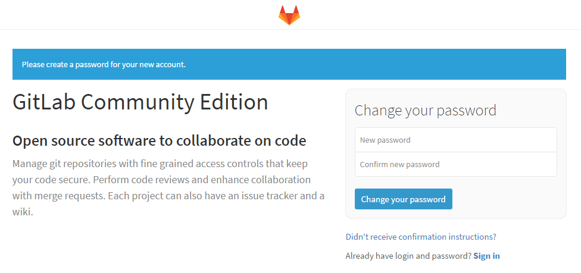
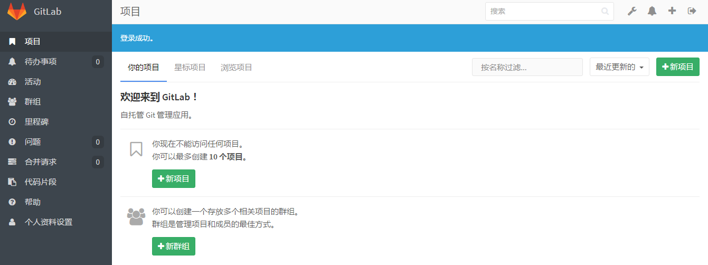

## gitlab的安装
```
wget https://mirrors.tuna.tsinghua.edu.cn/gitlab-ce/yum/el7/gitlab-ce-8.8.5-ce.1.el7.x86_64.rpm
yum install ./gitlab-ce-8.8.5-ce.1.el7.x86_64.rpm -y
gitlab-ctl reconfigure
gitlab-ctl start
```
第一次登录，配置一下root的密码


## 汉化

```
gitlab-ctl stop
wget https://github.com/larryli/gitlabhq/archive/8-8-zh.zip
unzip gitlabhq-8-8-zh.zip
\cp  /root/gitlabhq-8-8-zh/*  /opt/gitlab/embedded/service/gitlab-rails/  -rf
gitlab-ctl start
```
注意要多刷新几次浏览器或者ctrl+f5



