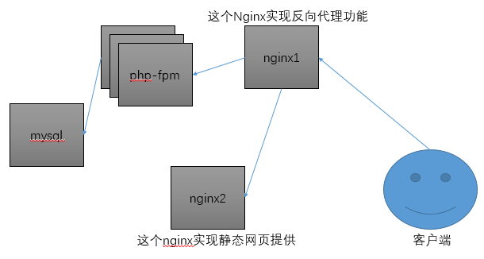

简单的lnnmp传输拓扑图

Nginx1主要是对外网提供网站服务，既然是对外网的提供服务器，那么我们就要考虑问题了。外网的网络带宽有限，这里对外网的传输我们就使用压缩传输；同时我们也希望数据的安全性，这里也需要提供https的加密传输；最重要的一点是这台服务器可以向后端转发客户端的请求。

Nginx2提供动态和静态数据给前端Nginx1，这里有一个非常严重的问题，这台主机不处理动态数据只是把动态数据转发给php-mysql，假如直接让代理服务器Nginx1把请求转发到php-fpm上。

mysql提供数据库服务，php-fpm提供PHP动态数据的处理



改良后的lnmp传输拓扑图

这样改良之后，会产生一个问题，前端的代理服务器Nginx1处理压力会变大，因为正则配置的性能完全不如直接转发。但是网站的请求有限，暂且采用这种。


# 网络关系

这里我的实验环境是一台Windows主机，使用的是vmwear,使用的虚拟机是centos7

Nginx1有两个网卡，一个设置的为桥接172.16.29.2，另一个设置的为仅主机模式192.168.95.129，安装Nginx-1.10.2

Nginx2有一个仅主机模式的网卡192.168.95.132，安装Nginx-1.10.2

php-fpm仅主机模式网卡192.168.95.131，安装php-fpm,php-mysql

MySQL仅主机模式的网卡192.168.95.130，安装mariadb-server

# mysql和php-fpm的配置

### php-fpm的配置

php-fpm依赖于http或Nginx

```bash
yum install php-fpm php-mysql -y
vim /etc/php-fpm.d/www.conf

listen = 0.0.0.0:9000 #监听在本机的所有网卡上
listen.allowed_clients = 192.168.95.132 #允许这个ip访问
pm.status_path = /status #开启状态页

mkdir -pv /var/www/html/phpwind #提供phpwind文件
cd
unzip phpwind_UTF8_8.7.1.zip -d /nginx/html/phpwind/
chown nginx:nginx /var/www/html/phpwind/
chown -R nginx:nginx /var/www/html/phpwind/
```

### mysql的配置

```bash
yum isntall mairadb-server -y
mysql <<eof
grant all on wpdb.* to 'wpuser'@'192.168.95.131' identified by 'wppasswd';
eof
```

# Nginx1的配置

```bash
cd
wget http://nginx.org/packages/centos/7/x86_64/RPMS/nginx-1.10.2-1.el7.ngx.x86_64.rpm
yum install ./nginx-1.10.2-1.el7.ngx.x86_64.rpm -y
cd /etc/nginx/conf.d
mv default.conf{,.bak}
vim www1.conf

server { #强制使用https通信
    listen 80;
    server_name www1.oldking.org;
    rewrite ^ https://$server_name$request_uri? permanent;
}
server {
    listen 443;
    server_name www1.oldking.org;
    ssl on;
    ssl_certificate /etc/nginx/ssl/nginx.crt;
    ssl_certificate_key /etc/nginx/ssl/nginx.key;
    location ~* \.php$ { #把php请求发送给php-fpm主机
        fastcgi_pass 192.168.95.131:9000;
        fastcgi_index   index.php;
        fastcgi_param   SCRIPT_FILENAME /var/www/html/phpwind/upload$fastcgi_script_name;
        include         fastcgi_params;
        fastcgi_param HTTPS on;
    }   
    location ~* ^/(status|ping)$ { #把php状态信息发送给php-fpm主机
        include        fastcgi_params;
        fastcgi_pass 192.168.95.131:9000;
        fastcgi_param  SCRIPT_FILENAME  $fastcgi_script_name;
    }   
    location / { #非静态和php数据，由Nginx1提供
        root /nginx/html/phpwind/upload;
        index index.php;
    }
    location ~* \.(jpg|png|gif|js|css)$ { #静态数据指向Nginx2
        proxy_pass http://192.168.95.132;
    }
}

vim ../nginx.conf #在http字段内添加如下内容，提供压缩传输

gzip  on;
gzip_comp_level 3;
gzip_min_length 4;
gzip_types text/xml text/css  application/javascript;

mkdir -pv /nginx/html/phpwind #提供phpwind文件
cd
unzip phpwind_UTF8_8.7.1.zip -d /nginx/html/phpwind/
chown nginx:nginx /nginx/html/phpwind/
chown -R nginx:nginx /nginx/html/phpwind/
```

# Nginx2的配置

```bash
cd #安装Nginx并提供配置文件
wget http://nginx.org/packages/centos/7/x86_64/RPMS/nginx-1.10.2-1.el7.ngx.x86_64.rpm
yum install ./nginx-1.10.2-1.el7.ngx.x86_64.rpm -y
cd /etc/nginx/conf.d
mv default.conf{,.bak}
vim www1.conf

server {
    listen 80;
    location / {
        root /var/www/html/phpwind/upload;
        index index.php;
    }   
}

mkdir -pv /nginx/html/phpwind #提供phpwind文件
cd
unzip phpwind_UTF8_8.7.1.zip -d /nginx/html/phpwind/
chown nginx:nginx /nginx/html/phpwind/
chown -R nginx:nginx /nginx/html/phpwind/
```

# 总结

全站https需要业务代码的支持，提供静态数据的服务器需要使用`~*`匹配然后指定，使用/来匹配的话数据会直接从Nginx2主机获取数据，并且不加处理的返回给Nginx1服务器，然后返回客户端。
