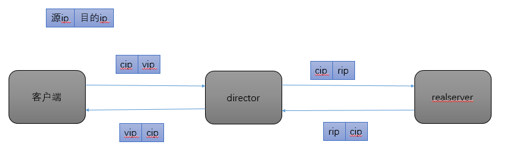
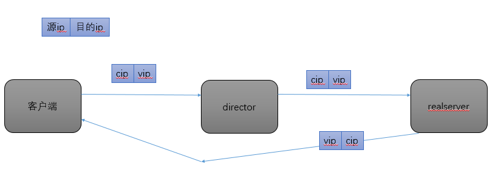
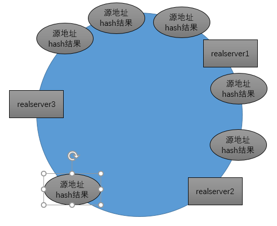
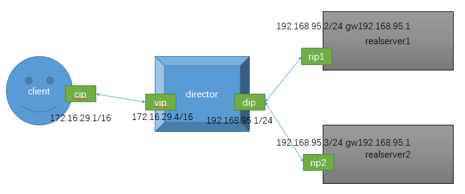
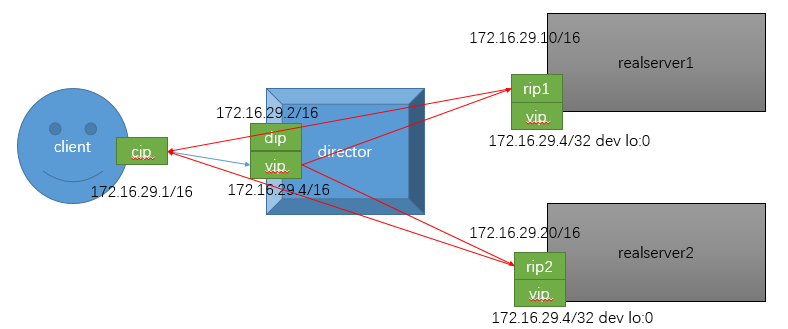
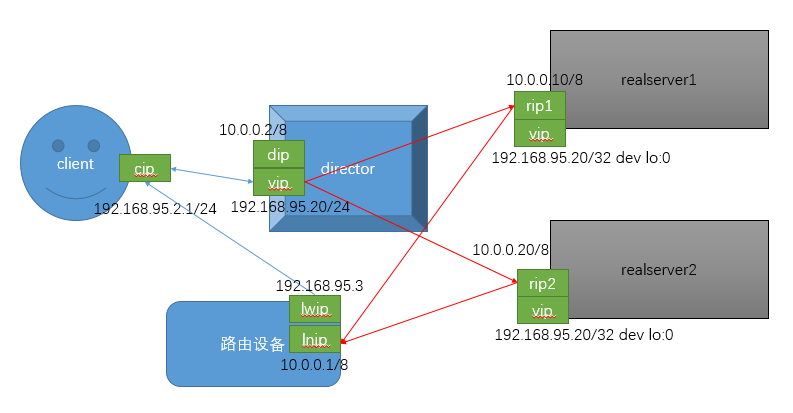

只解决c10k问题是不够的，单台主机的处理能力是有限的，一台主机同时处理500个动态网页请求已经是极限了。这里有两种方法提升处理性能，一，定制高性能的计算机，众所周知计算机硬件设计成本极其高，性能每提高10%成本就要增加一倍，这也是intel被称为挤牙膏公司的原因，不是其研发能力不行而是计算机硬件性能提升的难度太大，这个方法貌似不可行。二，使用两台主机处理业务，这就会引来一个问题怎么把请求分发到两个主机，这里我们引入了负载均衡器。


# 负载均衡

使用负载均衡有两个方法，一是采用商用负载均衡硬件的，这个方法是最好的方法，能上硬件一定不要使用软件，又是硬件同样的问题也是价格，只要是涉及到基础设施的服务一定要使用。一方面是硬件的稳定性，比软件好很多，虽然软件可维护性和拓展性比较好，但是对于一些金融公司，他们玩的就是公信力和大众信心，每个故障都是竞争对手拆台的理由，一旦故障硬件背锅，理赔。常用的硬件F5的Big-IP，Citrix的Netscaler，A10的A10

另一种是采用软件负载均衡，只要考虑成本使用负载均衡软件就对了，它的性能比硬件也不会差别太大，并且灵活。常用的有lvs，nginx，haproxy,ats。。。

在做负载均衡的时候，我们在7层模型的哪一层做负载均衡，ip层基于主机做负载均衡粒度太大可用性太差基本不使用，更低的层基本上没有价值了，tcp层的话我们就可以把不同服务的请求采取不同的方式负载均衡，应用层的话我们可以根据具体协议拆包分析后负载均衡，既然涉及到拆开数据包，那处理的数据量就会大大增加，那么对计算机性能要求也越高，性能就越差，并且负载均衡器的通用性也越差。

* 传输层：

	lvs，nginx：（stream），haproxy：（mode tcp）

应用层：

	http：nginx, httpd, haproxy(mode http)

	fastcgi：nginx, httpd

	mysql：mysql-proxy


# lvs工作方式和调度方法
### lvs的工作方式

有四种lvs-nat,lvs-dr,lvs-tun,lvs-fullnat

* lvs集群类型中的术语：

	vs：Virtual Server, Director, Dispatcher, Balancer

	rs：Real Server, upstream server, backend server

	CIP：Client IP, VIP: Virtual serve IP, RIP: Real server IP,

	DIP: Director IP

* lvs-nat

它的工作机制类似iptables的dnat功能，一次请求过程如下图



当客户端向director服务器发送数据，数据目的地址vip换为rip后，被转发到后端real server，real server处理完后把数据发送到director服务器，director把这个数据的源地址rip更改为vip。当然lvs-nat不仅仅是更改ip也可以更改端口，所以支持端口映射，由以上可以总结nat的特点，rip和dip必须在同一网络中；rs的网关需要指向dip，因为所有的数据必须经过director更改ip。

这种工作方式director很容成为网络瓶颈，因为所以的数据都要经过director，director网卡的吞吐量就代表整个网站的流量吞吐量，当今世界的慢慢走向5G，director是完全不能满足需求的，需要借助其它网络设备帮助director分担流量，这就引入了lvs-dr模型。

* lvs-dr



如图，lvs-dr也是在input链上更改数据，但是它更改的不是ip地址而是mac地址，它把目的mac地址vmac更改为rmac，这里就要求vip，rip，dip必须在广播域内，但是地址不一定要在一个网段，因为他们间的通信需要使用mac直接通信。realserver处理请求后直接把数据返回给客户端。

等等，不对啊！realserver是怎么给客户端发送数据包的，realserver服务器上只有rip怎么用vip给客户端通信，这里需要我们给realserver配置vip。但是有一个问题，在网络中多个主机拥有同一个ip会产生冲突的，我们的解决方案是只让director主机发送arp广播并且响应arp请求。这就要求其它主机不能广播自己的ip地址，其它服务器请求主动请求主机ip地址也不可以响应。

控制arp广播arp-ignore，0广播，1不广播；控制响应arp-announce，0响应所有接口信息，1尽量只响应当前网卡的信息，2只响应当前网卡的信息

lvs-dr的使用方法有两种，一种是每个realserver都有与公网交互的公网ip，另一种是只有内网ip，之后演示。

* lvs-tun

它是在原本的报文外部继续封装一个ip头，有可能造成超级帧

* lvs-fullnat

它是把源ip和目的ip都更改，相当于director请求realserver，realserver响应回来数据再把两个ip地址更改，这样这个数据包就可以跨越路由通信了，nat本来就会造成director网络瓶颈，它的使用场景主要应用于请求数据量不大但后服务器数量很多的场景。


### 调度方法

调用方法可以分为两类，一类是静态调度算法，一类是动态调用算法

* 静态算法

`rr`以轮询的方法，把请求转发到后端的主机

`wrr`加权轮询，把请求按照一定的比例转发后端主机

`sh`源地址哈希，把源地址做hash运算后，把realserver也hash，每个realserver只处理自己hash和上一realserver的hash之间的源地址的请求如图



`dh`目标地址哈希，某个URL被调度某个服务器之后，之后收到这个URL的请求都会调度到上次调度的服务器，这样realserver可以开启缓存了，命中率有一定的保证

* 动态算法

`lc`最少连接，根据realserver的正在处理请求的数量进行调度，Overhead=activeconns*256+inactiveconns

`wlc`加权最少连接，Overhead=(activeconns*256+inactiveconns)/weight

`sed`最短等等时间，`Overhead=(activeconns+1)*256/weight`

`nq`在`sed`的基础上改进的，意思是不许有realserver主机空闲

`lblc`动态的DH算法；基于地址的最小连接数调度（locality-based least-connection）：将来自同一个目的地址的请求分配给同一台RS，此时这台服务器是尚未满负荷的。否则就将这个请求分配给连接数最小的RS，并以它作为下一次分配的首先考虑

`lblcr`带复制功能的lblc，当一台服务器负载满了，调度到其它服务器提供服务，缓存的数据会被复制过去，并且之后的请求会被调度这台服务器


# ipvsadm的使用

## 管理集群服务：增、改、删；

* 增、改：

	ipvsadm -A|E -t|u|f service-address [-s scheduler] [-p [timeout]]

* 删：

```bash
ipvsadm -D -t|u|f service-address

[-s scheduler]：指定集群的调度算法，默认为wlc		

service-address：
	-t|u|f：
	-t: TCP协议的端口，VIP:TCP_PORT
	-u: TCP协议的端口，VIP:UDP_PORT
	-f：firewall MARK，是一个数字；
```

## 管理集群上的RS：增、改、删；

*	增、改：

ipvsadm -a|e -t|u|f service-address -r server-address [-g|i|m] [-w weight]

*	删：

	ipvsadm -d -t|u|f service-address -r server-address

	server-address：

	rip[:port]


# lvs-nat实现


nat实验拓扑图

这个使用我采用的是虚拟机，主机ip做cip，director的vip采用的桥接网络，dip和rip采用的是仅主机模式

realserver1执行的命令

```bash
yum install httpd -y #安装httpd
echo rs1 > /var/www/html/index.html #提供网页文件
```

realserver2执行的命令

```bash
yum install httpd -y
echo rs2 > /var/www/html/index.html
```

director执行的命令

```bash
yum install ipvsadm -y
ipvsadm -A -t 172.16.29.4:80 -s wrr
ipvsadm -a -t 172.16.29.4:80 -r 192.168.95.2 -m -w 1
ipvsadm -a -t 172.16.29.4:80 -r 192.168.95.3 -m -w 2
```

# lvs-dr

## 都采用公网ip的方案



所有网卡都采用桥接

director执行的命令

```bash
ifconfig eno16777736:0 172.16.29.4 netmask 255.255.255.255 broadcast 172.16.29.4 up #若在directer和realserver在同一个网段里一定要使用这一行
ipvsadm -A -t 172.16.29.4:80 -s wrr
ipvsadm -a -t 172.16.29.4:80 -r 172.16.29.10 -g -w 1
ipvsadm -a -t 172.16.29.4:80 -r 172.16.29.20 -g -w 2
```

realserver执行的命令

```bash
echo 1 > /proc/sys/net/ipv4/conf/all/arp_ignore
echo 1 > /proc/sys/net/ipv4/conf/lo/arp_ignore
echo 2 > /proc/sys/net/ipv4/conf/lo/arp_announce
echo 2 > /proc/sys/net/ipv4/conf/all/arp_announce
ifconfig lo:0 172.16.29.4 netmask 255.255.255.255 broadcast 172.16.29.4 up
route add -host 172.16.29.4 dev lo:0
```

## 只要一个公网ip的解决方案



全部接口采用的仅主机模式，并且每个主机只有一个网卡，每个网卡都先配置一个ip，后期再添加需要的ip

director要执行的命令

```bash
ifconfig eno16777736:0 192.168.95.20 netmask 255.255.255.0 broadcast 192.168.95.20
ipvsadm -A -t 192.168.95.20:80 -s wrr
ipvsadm -a -t 192.168.95.20:80 -r 10.0.0.10 -g -w 2
ipvsadm -a -t 192.168.95.20:80 -r 10.0.0.20 -g -w 2
```

realserver需要执行的命令

```bash
echo 1 > /proc/sys/net/ipv4/conf/all/arp_ignore
echo 1 > /proc/sys/net/ipv4/conf/lo/arp_ignore
echo 2 > /proc/sys/net/ipv4/conf/lo/arp_announce
echo 2 > /proc/sys/net/ipv4/conf/all/arp_announce
ifconfig lo:0 192.168.95.20 netmask 255.255.255.255 broadcast 192.168.95.20 up
route add -host 192.168.95.20 dev lo:0
route add default gw 10.0.0.1
```

路由设备需要执行的命令

```bash
echo 1 > /pro/sys/net/ipv4/ip_forward #开启转发功能
```

# 多端口绑定和持久连接

## FWM：FireWall Mark

借助于防火墙标记来分类报文，而后基于标记定义集群服务；可将多个不同的应用使用同一个集群服务进行调度；

打标记方法（在Director主机）：

`iptables -t mangle -A PREROUTING -d $vip -p $proto --dport $port -j MARK --set-mark NUMBER`

基于标记定义集群服务`ipvsadm -A -f NUMBER [options]`

### lvs persistence：持久连接

持久连接模板：实现无论使用任何算法，在一段时间内，实现将来自同一个地址的请求始终发往同一个RS；

`ipvsadm -A|E -t|u|f service-address [-s scheduler] [-p [timeout]]`

### port Affinity：

每端口持久：每集群服务单独定义，并定义其持久性；

每防火墙标记持久：基于防火墙标记定义持久的集群服务；可实现将多个端口上的应用统一调度，即所谓的port Affinity；

每客户端持久：基于0端口定义集群服务，即将客户端对所有应用的请求统统调度至后端主机，而且可使用持久连接进行绑定；


# 总结

lvs是负载均衡器中最基本的，理解了它的原理和使用方法，基本上掌握了大多数的负载均衡器的原理。其中dr模型是必须掌握的，真正使用的话我感觉会使用dr，net的功能很有可能被7层代理的服务器替代了。多端口绑定功能也很常用比如80和443端口绑定统一调度；持久连接虽然破坏调度效果，但是在没有session缓存服务器的话还是很高效的。
