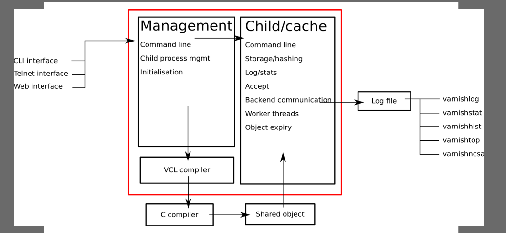
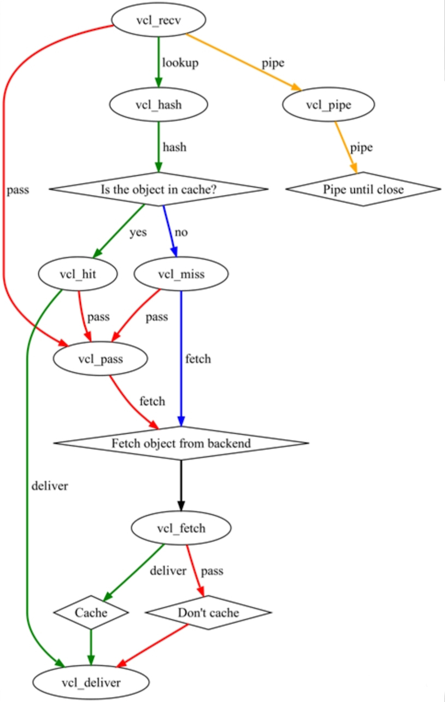
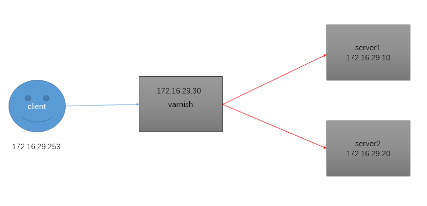

在nginx里我们引入了缓存功能，把对某些请求的结果缓存下来，下次请求直接使用数据响应，这样极大的节省了系统获取源数据资源的时间，若我们把大量的请求结果都使用缓存服务器来响应，那么我们可以大大减少计算机数量减少成本。既然要使用缓存那么就会引来问题，缓存的数据什么时间失效，万一多台缓存服务器损坏一台后，缓存结果怎么处理。


# 目录

varnish控制

缓存项控制

日志

实践


# 缓存服务器类型

缓存服务器的类型常用的有memched、squid、varnish，这里我们使用varnish，因为它的功能更加多样更加便捷，正在取代squid；squid是传统运行比较稳健的缓存服务器，memched比较老旧。

varnish的架构图



## varnish主要包含三个部分

management提供管理接口，并控制缓存进程的特性

child/cache提供缓存功能，记录日志，访问控制，后端服务器管理

vcl给child/cache提供配置文件的编译

## varnish程序结构

```bash
	/etc/varnish/varnish.params： 配置varnish服务进程的工作特性，例如监听的地址和端口，缓存机制；
	/etc/varnish/default.vcl：配置各Child/Cache线程的缓存工作属性；
	主程序：
		/usr/sbin/varnishd
	CLI interface：
		/usr/bin/varnishadm
	Shared Memory Log交互工具：
		/usr/bin/varnishhist
		/usr/bin/varnishlog
		/usr/bin/varnishncsa
		/usr/bin/varnishstat
		/usr/bin/varnishtop		
	测试工具程序：
		/usr/bin/varnishtest
	VCL配置文件重载程序：
		/usr/sbin/varnish_reload_vcl
	Systemd Unit File：
		/usr/lib/systemd/system/varnish.service
			varnish服务
		/usr/lib/systemd/system/varnishlog.service
		/usr/lib/systemd/system/varnishncsa.service
			日志持久的服务；
```

# 缓存运作方式

缓存的数据存储方式：key/value的方式存储，还记得nginx存储时，是把key保存在内存中，把value的数据存储在磁盘上，这里就有问题了，同样是在磁盘里存储数据，为什么使用key/value存储方式数据是可以提高获取速度的提高，因为文件系统读取数据需要遍历存储树，而我们缓存的时候使用的是一个层级结构，数据的位置可以预测。这里涉及到我们缓存使用的算法，我们把请求报文进行进行hash运算后按照hash结果的后两位的数据的数值创建文件夹，每个对应每个对应位都放在相应的文件夹，然后再把后3和4位数据创建文件夹。

vanish的缓存数据的方式有三种

```bash
	vanish -s [name=]type[,options]
	type的三种类型
		· malloc[,size]
			内存存储，[,size]用于定义空间大小；重启后所有缓存项失效；
		· file[,path[,size[,granularity]]]
			文件存储，黑盒；重启后所有缓存项失效；
		· persistent,path,size
			文件存储，黑盒；重启后所有缓存项有效；实验；
	varnish程序的选项：
	程序选项：/etc/varnish/varnish.params文件
		-a address[:port][,address[:port][...]，默认为6081端口；
		-T address[:port]，默认为6082端口；
		-s [name=]type[,options]，定义缓存存储机制；
		-u user
		-g group
		-f config：VCL配置文件；
		-F：运行于前台；
		...
	运行时参数：/etc/varnish/varnish.params文件， DEAMON_OPTS
		DAEMON_OPTS="-p thread_pool_min=5 -p thread_pool_max=500 -p thread_pool_timeout=300"

		-p param=value：设定运行参数及其值； 可重复使用多次；
		-r param[,param...]: 设定指定的参数为只读状态；
在使用内存缓存数据时，我们需要考虑内存回收和内存空间碎片化，我们的使用方法是把内存提前分片，然后使用。varnish使用内存是使用c语言的malloc，jemalloc-3.6.0-1.el7.x86_64提供这个功能
线程相关的参数，在线程池内部，其每一个请求由一个线程来处理； 其worker线程的最大数决定了varnish的并发响应能力；
	thread_pools #child数量，最好小于或等于CPU核心数量；
	thread_pool_max #每个进程最多可以开启的线程数
	thread_pool_min #额外意义为“最大空闲线程数”；
最大并发连接数=thread_pools  * thread_pool_max		
	thread_pool_timeout：Thread idle threshold.  Threads in excess of thread_pool_min, which have been idle for at least this long, will be destroyed.
	thread_pool_add_delay：Wait at least this long after creating a thread.
	thread_pool_destroy_delay：Wait this long after destroying a thread.

	设置方式：
		vcl.param
	永久有效的方法：
		vim /etc/varnish/varnish.params
			DEAMON_OPTS="-p PARAM1=VALUE -p PARAM2=VALUE"
```


# 缓存项控制

以上是控制child程序运行的基本属性，真正实现缓存功能的定义来至于vcl定义的属性，vcl才varnish真正的配置文件，vcl的配置文件是/etc/default.vcl这个配置文件的属性如下

```
	vcl的语法格式：
	(1) VCL配置文件需要以vcl 4.0这个配置开始;
	(2) //, # 和 /* foo */作注释;
	(3) 可以定义函数然后调用; 例如sub vcl_recv { ...}；
	(4) No loops, state-limited variables（受限于引擎的内建变量）；
	(5) Terminating statements with a keyword for next action as argument of the return() function, i.e.: return(action)；用于实现状态引擎转换；
	(6) Domain-specific;

	The VCL Finite State Machine
	(1) Each request is processed separately;
	(2) Each request is independent from others at any given time;
	(3) States are related, but isolated;
	(4) return(action); exits one state and instructs Varnish to proceed to the next state;
	(5) Built-in VCL code is always present and appended below your own VCL;
```

### 结构

介绍配置之前我们需要了解varnish的child的运行是调用个状态引擎的顺序，VCL有多个状态引擎，状态之间存在相关性，但状态引擎彼此间互相隔离；每个状态引擎可使用return(x)指明关联至哪个下一级引擎；每个状态引擎对应于vcl文件中的一个配置段，即为subroutine，各引擎调用关系如下



### 引擎

我们调用引擎使用return命令就可以了，这些引擎可以分为两类，一种是面对客户端的，一种是面对后端服务器的

客户端的

```
	vcl_rev #内可以调用这些引擎，在这个引擎内我们可以定义对哪些请求进行使用缓存不使用缓存
		hash：vcl_hash #查缓存
		pass: vcl_pass
		pipe: vcl_pipe
		synth: vcl_synth
		purge: vcl_hash --> vcl_purge				
	vcl_deliver #使用缓存响应
	vcl_hit
	vcl_miss
	vcl_pass #不使用缓存
	vcl_synth
	vcl_purge #对已经缓存的数据进行修剪，重新缓存
	vcl_pipe
后端服务器的
	vcl_backend_fetch
	vcl_backend_response
	vcl_backend_error
```

### 变量

```bash
内建变量
	req.*：request，表示由客户端发来的请求报文相关；
		req.http.*
			req.http.User-Agent, req.http.Referer, ...
	bereq.*：由varnish发往BE主机的httpd请求相关；
		bereq.http.*
	beresp.*：由BE主机响应给varnish的响应报文相关；
		beresp.http.*
	resp.*：由varnish响应给client相关；
	obj.*：存储在缓存空间中的缓存对象的属性；只读；

常用变量：
	bereq.*, req.*：
		bereq.http.HEADERS
		bereq.request：请求方法；
		bereq.url：请求的url；
		bereq.proto：请求的协议版本；
		bereq.backend：指明要调用的后端主机；

		req.http.Cookie：客户端的请求报文中Cookie首部的值；
		req.http.User-Agent ~ "chrome"


	beresp.*, resp.*：
		beresp.http.HEADERS
		beresp.status：响应的状态码；
		reresp.proto：协议版本；
		beresp.backend.name：BE主机的主机名；
		beresp.ttl：BE主机响应的内容的余下的可缓存时长；

	obj.*
		obj.hits：此对象从缓存中命中的次数；
		obj.ttl：对象的ttl值

	server.*
		server.ip
		server.hostname
	client.*
		client.ip
用户自定义：
	set
	unset
```


# 日志

```bash
1、varnishstat - Varnish Cache statistics
	-1
	-1 -f FILED_NAME
	-l：可用于-f选项指定的字段名称列表；
	MAIN.cache_hit
	MAIN.cache_miss
	# varnishstat -1 -f MAIN.cache_hit -f MAIN.cache_miss
2、varnishtop - Varnish log entry ranking
	-1     Instead of a continously updated display, print the statistics once and exit.
	-i taglist，可以同时使用多个-i选项，也可以一个选项跟上多个标签；
	-I <[taglist:]regex>
	-x taglist：排除列表
	-X  <[taglist:]regex>
3、varnishlog - Display Varnish logs
4、 varnishncsa - Display Varnish logs in Apache / NCSA combined log format
```


# 实践

这里我做的实验是，varnish有两个后端主机，网页使用缓存，但是login目录下的内容不使用缓存，这里我们把后端主机的/login下页面定义不一样，这样我们可以看到不使用缓存的效果，同时varnish主机自己可以刷新缓存数据。


### varnish的配置

varnish在epel源中，版本是4.0.4

```bash
yum install varnish
vim /etc/varnish/varnish.params #只更改如下一行
	VARNISH_LISTEN_PORT=80

vim /etc/varnish/default.vcl
	vcl 4.0;
	import directors;
	backend default {
	    .host = "127.0.0.1";
	    .port = "8080";
	}
	probe check {
	    .url = "/index.html";
	    .window = 5;
	    .threshold = 3;
	    .interval = 2s;
	    .timeout = 1s;
	}
	backend server1 {
	    .host = "172.16.29.10";
	    .port = "80";
	    .probe = check;
	}
	backend server2 {
	    .host = "172.16.29.20";
	    .port = "80";
	    .probe = check;
	}
	sub vcl_init {
	    new static = directors.round_robin();
	    static.add_backend(server1);
	    static.add_backend(server2);
	}
	sub vcl_recv {
	    set req.backend_hint = static.backend();
	    if (req.url ~ "(?i)^/login") {
	        return(pass);
	    }
	acl purgers {
		"127.0.0.0"/8;
	}
	sub vcl_recv {
		if (req.method == "PURGE") {
			if (!client.ip ~ purgers) {
				return(synth(405,"Purging not allowed for " + client.ip));
			}
			return(purge);
		}
	}
	sub vcl_purge {
		return (synth(200,"Purged"));
	}
	sub vcl_backend_response {
	}
	sub vcl_deliver {
	}
```

* 注意：default.vcl的配置文件使用的类c语言的编程方式，那么就会有一个问题，被调用的函数需要在调用前定义，所有定义引擎的时候需要注意顺序

### server1的配置

```bash
	yum install httpd
	echo 1 > /var/www/html/index.html
	mkdir /var/www/html/login/
	echo login1 > /var/www/html/login/index.html
```

### server2的配置

```bash
	yum install httpd
	echo 2 > /var/www/html/index.html
	mkdir /var/www/html/login/
	echo login2 > /var/www/html/login/index.html
```

### 使用zabbix监控varnish的模板

下载路径如下https://raw.githubusercontent.com/rdvn/zabbix-templates/master/varnish

* 注意：下载的时候要在raw把内容复制到一个文件里，然后导入使用，右键另存为的不是源码不可以使用。

zabbix的使用可以参考http://oldking.blog.51cto.com/10402759/1889514


# 总结

在这个缓存为王的时代，熟练使用varnish很重要。
