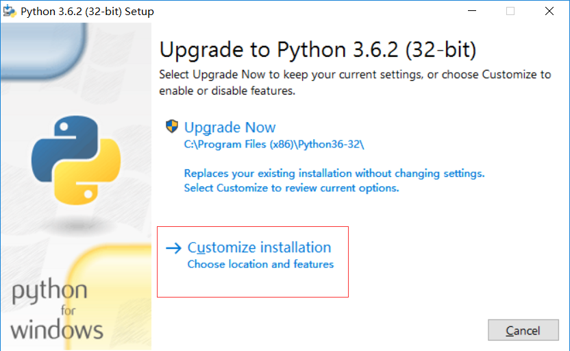
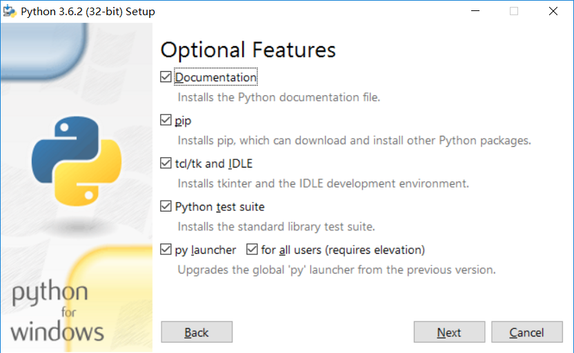

# windows编程环境

vscode下载https://code.visualstudio.com/Download

python下载https://www.python.org/downloads/

## pip配置

用户家目录下创建pip文件夹

在pip文件夹创建pip.conf，添加如下内容
```
[global]
timeout = 6000
index-url = https://mirrors.aliyun.com/pypi/simple/
```

## python安装步骤如图





vscode插件选择可以参考如下博客
http://www.cnblogs.com/bloglkl/archive/2016/08/23/5797805.html
