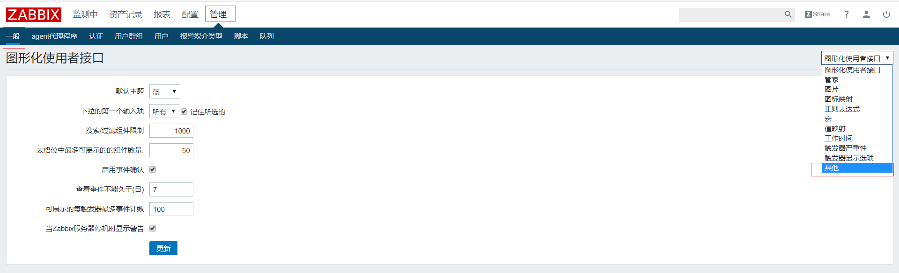
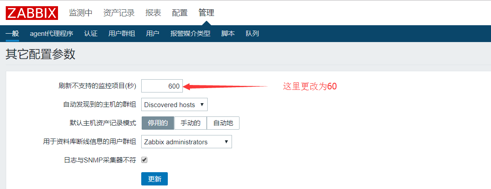

# Iterm不支持

zabbix定义好key之后，总是会出现Not supported，首先鼠标点击当前key的红叉，会显示出报错内容

## 导致`不支持`原因有如下三种：

* zabbix_server取不到值，或者取到空值

  这里要判断脚本问题

* 取到的值和key的类型不一样

  这里可能是脚本的报错信息返回给Zabbix服务器了

* 脚本执行超时，默认情况下zabbix3秒内获取不到数据就任务超时

  这里可以修改/etc/zabbix/zabbix_agent.conf里的Timeout的为30s(最大可设置为30s)，如`Timeout=30`；或者修改/etc/zabbix/zabbix_server.conf里的Timeout的为30s(最大可设置为30s)，如`Timeout=30`

## 修复脚本之后

脚本修复后，key依然是`不支持`状态，恢复为`启用`状态有如下三种方法

* 等10分钟，zabbix会去重新check一次当前item的Supported状态。
* 删掉当前item，重新创建
* 修改zabbix重新check的时间，例如改成10分钟，点击administration--->General--->右侧下拉条选择"other"--->Refresh unsupported items (in sec)改为60（单位为秒）---->update

