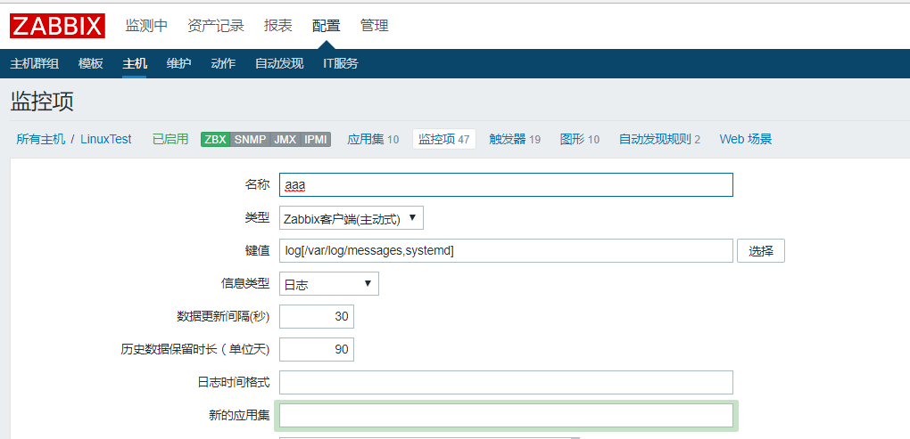
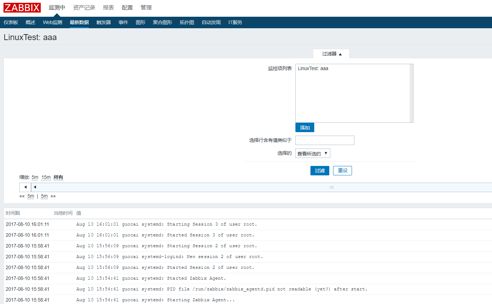

Zabbix有一个重量级的东西：日志监控。下面演示一个简单的使用

# agent配置

编辑/etc/zabbix/zabbix_agentd.conf
```bash
# Zabbix-server的地址，这里之所以要修改
# 是因为日志监控使用的是Zabbix主动监控，agent需要一个和主控通信的接口
ServerActive=172.16.16.16

# 主机名要和Zabbix网页上的一致，不一致zabbix-agent会获取不到数据
# 不一致时，在/var/log/zabbix/zabbix_agentd.log中会有如下一条错误：
# no active checks on server [172.16.16.16:10051]: host [Zabbix Test] not found
Hostname=LinuxTest
```

# Zabbix网页配置
最简单的配置

`chmod +r /var/log/messages`给messages文件添加读权限，以让zabbix用户可以读取文件



```
名称：aaa
类型：Zabbix客户端（主动式）
键值：log[/var/log/messages,systemd]
信息类型：日志
```
在``最新数据``里我们可以看到监控到的数据


可用的键值有三个分别是:

`log[/path/to/some/file,<regexp>,<encoding>,<maxlines>,<mode>,<output>]`

`logrt[/path/to/some/filename_format,<regexp>,<encoding>,<maxlines>,<mode>,<output>]`

`eventlog[name,<regexp>,<severity>,<source>,<eventid>,<maxlines>,<mode>]`

* regexp：要匹配内容的正则表达式，或者直接写你要检索的内容也可以，例如我想检索带systemd关键词的记录
* encoding：编码相关，留空即可
* maxlines：一次性最多提交多少行，这个参数覆盖配置文件zabbxi_agentd.conf中的’MaxLinesPerSecond’，我们也可以留空
* mode：默认是all，也可以是skip，skip会跳过老数据
* output：输出给zabbix server的数据。可以是\1、\2一直\9，\1表示第一个正则表达式匹配出得内容，\2表示第二个正则表达式匹配错的内容。

## logrt示例

logrt["/home/zabbix/logs/^logfile[0-9]{1,3}$",,,100]

logrt[E:\liumeiti\CentralService\Log\Dispatcher\2017.8\.*log$,"MySQL server has gone away",gb2312]
