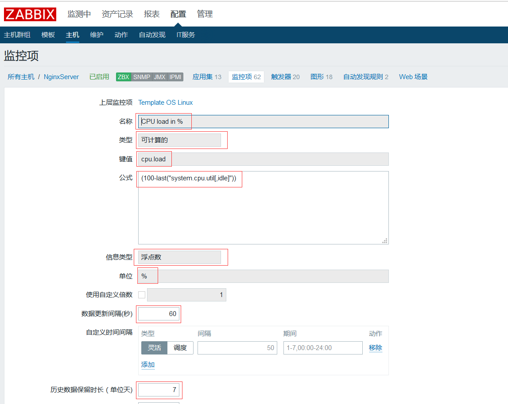

常用key类型无非三种：一，“zabbix客户端”类型的key，这些key通常由zabbix内置；二，自定义key，这种key是我们在zabbix客户端通过自己编辑脚本采集数据，在调用时类型依然选择“zabbix客户端”类型，key的话需要手动填写；三，“可计算的”，有时zabbix监控的数据不是我们需要的数据，但是我们可以通过已经监控的item生成需要的数据

以下以cpu使用率为例子，这也是我遇到的一些问题及我的处理方案。具体情况是：Windows只能监控到CPU load这种数据不能以`10%`这种格式展示，很不直观；linux可以监控到CPU使用率可以以`10%`展示，但是只有空闲率。

## zabbix客户端

Windows监控cpu使用率`perf_counter[\Processor(_Total)\% Processor Time]`这是zabbix提供的key

## 自定义key

`UserParameter=stream_total,ls /FileRoot/live/|grep .*\.m3u8$|wc -l`

key名称填写stream_total，就可以调用这个自定义key了

## 可计算的key

linux只提供了监控空闲使用率的`system.cpu.util[,idle]`，距离我们想要的数据还还差一点：

1、在模板中或是主机中选择监控项 -> 选择Create item

2、监控的名称和key按照其功能随便起一个名字，如：cpu.load，key的类型选择"可计算的"，这时会出现一个"公式"的对话框，里面填写计算公式`(100-last("system.cpu.util[,idle]"))`

3、信息类型填写"浮点数"，单位填写"%"

4、最后点保存提交，完成key的定义。

### 常用的计算类型key定义时用的有以下几种公式：

1、计算空闲磁盘空间的比例：`100*last("vfs.fs.size[/,free]")/last("vfs.fs.size[/,total]")`

2、计算10分钟主机出流量的平均值：`avg("Zabbix Server:net.if.out[eth0,bytes]",600)`

3、计算网卡总流量：`last("net.if.in[eth0,bytes]")+last("net.if.out[eth0,bytes]")`

4、计算进流量占网卡总流量的比例：`100*last("net.if.in[eth0,bytes]")/(last("net.if.in[eth0,bytes]")+last("net.if.out[eth0,bytes]"))`

5、在计算项目中正确使用聚合条目，注意双引号如何被转义: `last("grpsum[\"video\",\"net.if.out[eth0,bytes]\",\"last\",\"0\"]")/last("grpsum[\"video\",\"nginx_stat.sh[active]\",\"last\",\"0\"]")`

6、计算多台主机出流量的和：`last("192.168.1.100:net.if.out[eth0,bytes]")+last("192.168.2.200:net.if.out[eth0,bytes]")+last("192.168.1.110:net.if.out[eth0,bytes]")`
