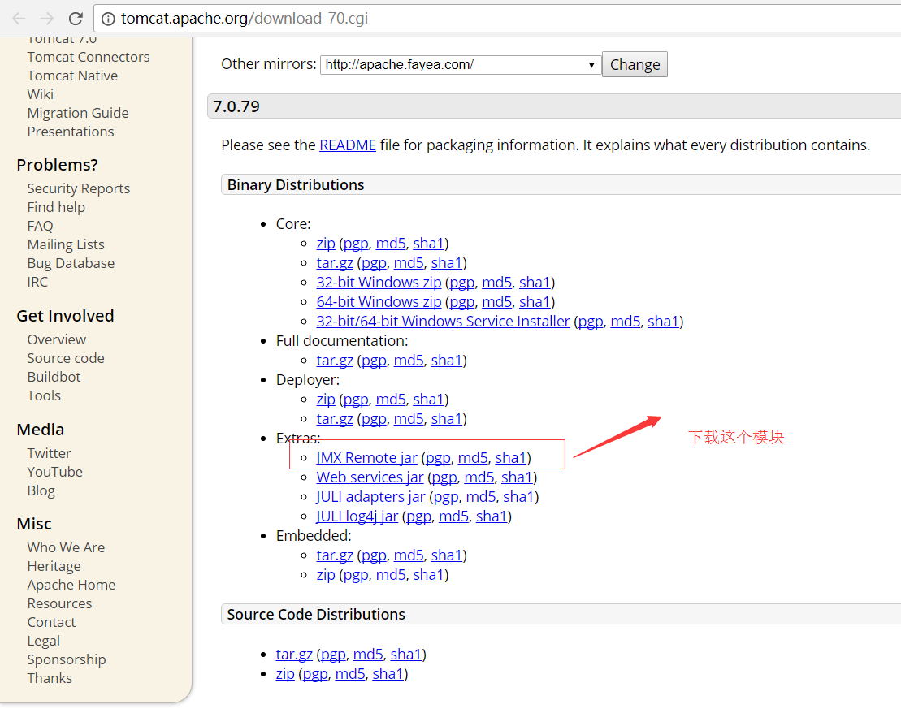
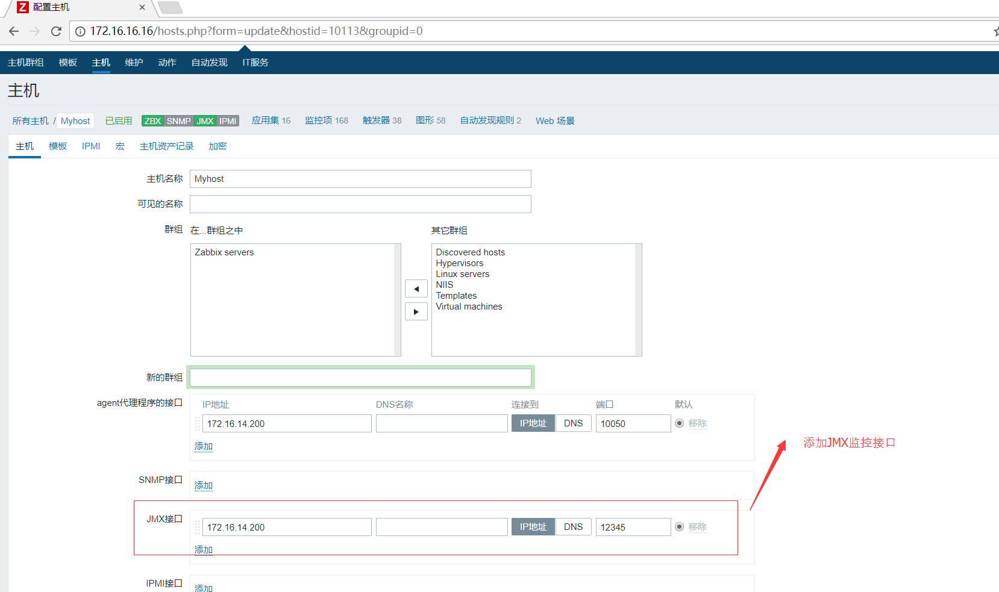

## tomcat的配置
下载监控模块的路径：http://tomcat.apache.org/download-70.cgi



保存到tomcat安装路径下的lib目录下

windows编辑tomcat安装路径下的bin/catalina.bat
```bash
# 在setlocal之后添加如下内容
set JAVA_OPTS=%JAVA_OPTS% -Dcom.sun.management.jmxremote -Dcom.sun.management.jmxremote.port=12345 -Dcom.sun.management.jmxremote.authenticate=false -Dcom.sun.management.jmxremote.ssl=false
```

linux编辑omcat安装路径下的bin/catalina.sh
```bash
# 在setlocal之后添加如下内容
CATALINA_OPTS=$CATALINA_OPTS -Dcom.sun.management.jmxremote -Dcom.sun.management.jmxremote.authenticate=false -Dcom.sun.management.jmxremote.ssl=false -Dcom.sun.management.jmxremote.port=12345
```

重启tomcat

## zabbix配置

安装启动zabbix-java-gateway
```bash
yum install zabbix-java-gateway -y
systemctl start zabbix-java-gateway.service
systemctl enable zabbix-java-gateway.service

```

修改/etc/zabbix/zabbix_server.conf，配置zabbix-server调用gateway

```bash
### JavaGateway
JavaGateway=127.0.0.1
JavaGatewayPort=10052
StartJavaPollers=5
```

```bash
# 重启zabbix-server
systemctl restart zabbix-server.service
```


