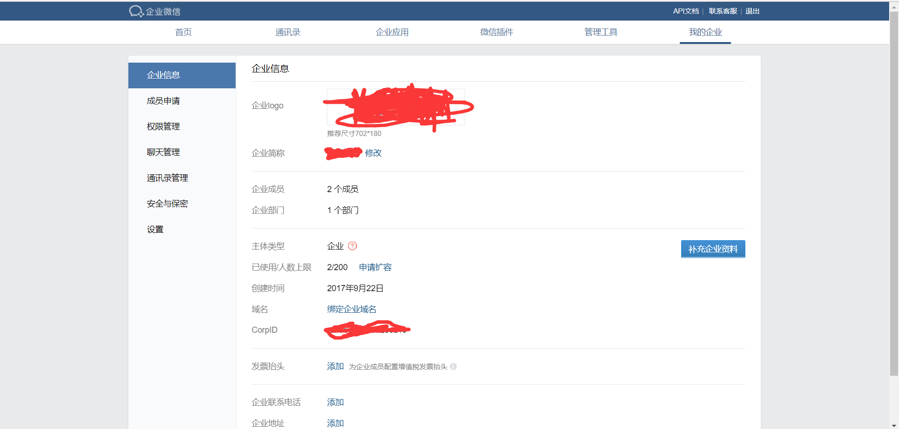
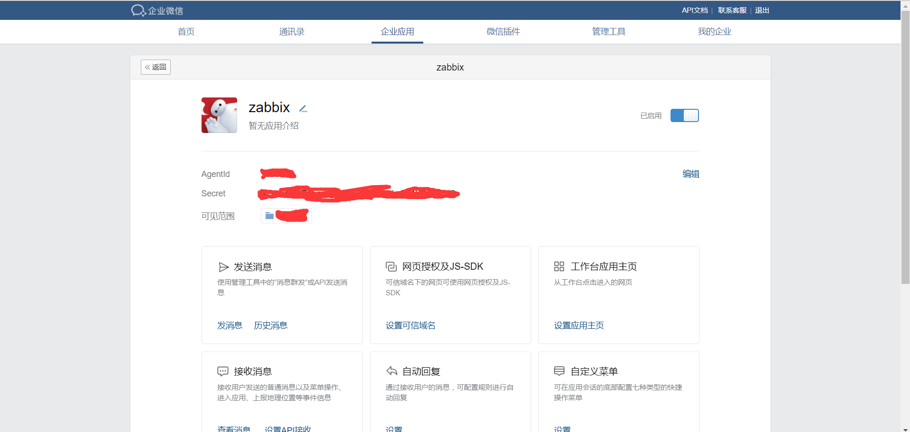
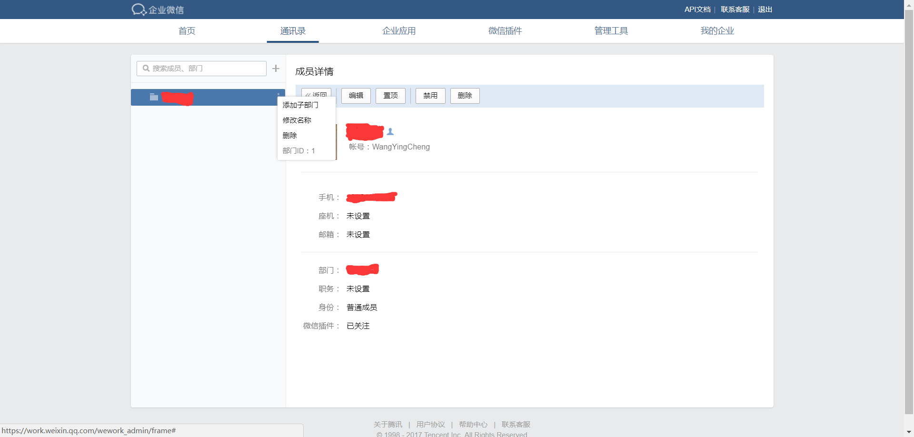

# 微信告警

zabbix支持自定义报警方式，那么我们就可以借助各种常用通信工具的api进行告警，这里我使用比较常用的微信作为报警工具，当然也可以使用QQ，钉钉等作为报警工具

## 报警脚本的编写


```bash
#!/bin/bash
# 公司ID
CropID='xxxxx'
# 密码
Secret='xxxxx'
# 获取发送信息所需要token的URL
GURL="https://qyapi.weixin.qq.com/cgi-bin/gettoken?corpid=$CropID&corpsecret=$Secret"
# 获取token，这个命令随着微信api的变化需要相应的变化
Gtoken=$(/usr/bin/curl -s -G $GURL | awk -F '"' '{print $10}')
# 查看是否正确获取token
# echo $Gtoken
# 发送消息的URL
PURL="https://qyapi.weixin.qq.com/cgi-bin/message/send?access_token=$Gtoken"

function body() {
        # 企业号中的应用id
        local int AppID=1000002
        # 部门成员id，zabbix中定义的微信接收者
        local UserID=$1
        # 部门id，定义了范围，组内成员都可接收到消息
        local PartyID=1
        # 过滤出zabbix传递的第三个参数
        local Msg=$(echo "$@" | cut -d" " -f3-)
        printf '{\n'
        printf '\t"touser": "'"$UserID"\"",\n"
        printf '\t"toparty": "'"$PartyID"\"",\n"
        printf '\t"msgtype": "text",\n'
        printf '\t"agentid": "'" $AppID "\"",\n"
        printf '\t"text": {\n'
        printf '\t\t"content": "'"$Msg"\""\n"
        printf '\t},\n'
        printf '\t"safe":"0"\n'
        printf '}\n'
}
/usr/bin/curl --data-ascii "$(body $1 $2 $3)" $PURL &> /dev/null
```

## 各个ID的位置

### CorpID

在‘我的企业中’查找CorpID



### AppID和Secret

AppID对应的是Agentid



### UserID和PartyID

PartyID对应的是部门ID,UserID对应的是账号


