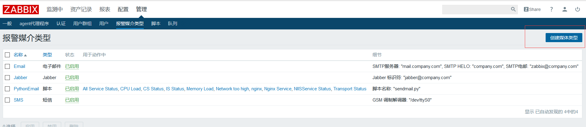
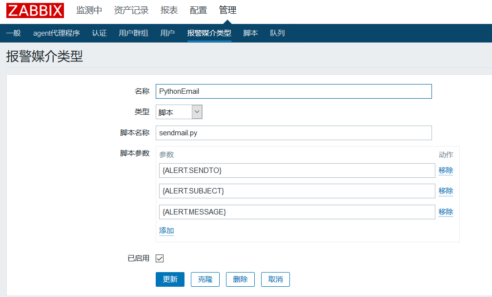

## 安装python34

安装python34(我使用的是阿里云的epel源)
```
yum install python34 -y
```


## 第一版
非常难用，这里使用的是个人邮件发送最好使用第二版通过第三方邮件服务发送邮件

编辑脚本文件/usr/lib/zabbix/alertscripts/sendmail.py
```python
#!/usr/bin/python3
#coding: utf-8
import smtplib
from email.mime.text import MIMEText
from email.header import Header

_, sendto, subject, *msgbody = sys.argv
sender = '********@21cn.com'
smtpserver = 'smtp.21cn.com'
username = sender
password = '******'

msg =  MIMEText(' '.join(msgbody),'plain','gb2312')
msg['Subject'] = subject
msg['From'] = sender
msg['To'] = sendto
smtp = smtplib.SMTP()
smtp.connect(smtpserver)
smtp.login(username, password)
smtp.sendmail(sender, i, msg.as_string())
smtp.quit()
```


## 版本二
这一版使用的是sendcloud发送邮件(请百度：)，可以通过zabbix传递的数据发送特定的邮件
```python
#!/usr/bin/python3
# coding: gb2312
import requests
import sys
# import json

# 获取要传递的参数
_, sendto, subject, *msgbody = sys.argv
url = "http://api.sendcloud.net/apiv2/mail/send"
# 您需要登录SendCloud创建API_USER，使用API_USER和API_KEY才可以进行邮件的发送。
params = {
    # apiUser
    "apiUser": "mortimer_****_******",
    # apiKey
    "apiKey": "******",
    "from": "service@sendcloud.im",
    # fromName
    "fromName": "*******",
    # 一下三个是通过zabbix传递参数，不需要修改
    "to": sendto,
    "subject": subject,
    "html": ' '.join(msgbody),
}

r = requests.post(url, files={}, data=params)
# print(r.text)
```

## 使用方法





传递的参数分别为
```bash
# 用户通知方式
{ALERT.SENDTO}
# 标题
{ALERT.SUBJECT}
# 发送的信息
{ALERT.MESSAGE}
```
